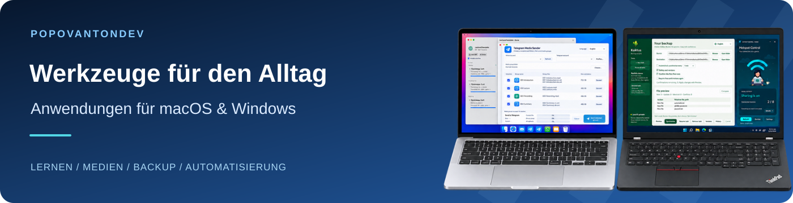

<a href="README.ru.md">Русский</a> · <a href="README.de.md">Deutsch</a> · <a href="README.md">English</a>

Ich entwickle Desktop-Anwendungen fürs Lernen, für Medien und für alltägliche Aufgaben unter macOS und Windows.

**[→ Anwendungen und Anleitungen entdecken](https://popovantondev.github.io/popovantondev/index-de.html)**

## Ausgewählte Anwendungen

<table>
<tr>
<td width="50%" valign="top"><h3><a href="https://github.com/popovantondev/TelegramMediaSender">Telegram Media Sender</a></h3>
Sendet nummerierte Pakete aus Video, Audio und Untertiteln in der gewählten Reihenfolge an Telegram.

macOS 13+ · Apple Silicon Release 1.1.2

<a href="https://github.com/popovantondev/TelegramMediaSender/releases/tag/v1.1.2">Herunterladen</a> · <a href="https://popovantondev.github.io/TelegramMediaSender/Guide-de.html">Anleitung</a> · <a href="https://github.com/popovantondev/TelegramMediaSender/issues/new/choose">Fehler melden</a>
</td>
<td width="50%" valign="top"><h3><a href="https://github.com/popovantondev/AnkiSound">Anki SOUND</a></h3>
Ergänzt ausgewählte Anki-Karten um lokale Sprachausgabe und erstellt ein separat geprüftes Paket.

macOS 13+ · Apple Silicon Release 3.4.11

<a href="https://github.com/popovantondev/AnkiSound/releases/tag/v3.4.11">Herunterladen</a> · <a href="https://popovantondev.github.io/AnkiSound/Guide-de.html">Anleitung</a> · <a href="https://github.com/popovantondev/AnkiSound/issues/new/choose">Fehler melden</a>
</td>
</tr>
<tr>
<td width="50%" valign="top"><h3><a href="https://github.com/popovantondev/LectureTranslate">LectureTranslate</a></h3>
Übersetzt deutsche SRT-Untertitel ins Russische mit Zeitcodes, Warteschlange und Entwurfsprüfung.

macOS 15+ · Apple Silicon Release 3.5.1

<a href="https://github.com/popovantondev/LectureTranslate/releases/tag/v3.5.1">Herunterladen</a> · <a href="https://popovantondev.github.io/LectureTranslate/Guide-de.html">Anleitung</a> · <a href="https://github.com/popovantondev/LectureTranslate/issues/new/choose">Fehler melden</a>
</td>
<td width="50%" valign="top"><h3><a href="https://github.com/popovantondev/LectureMerge">LectureMerge</a></h3>
Verbindet Vorlesungsvideo, Sprachausgabe, Originalton und Untertitel als MP4; exportiert auch Audio.

macOS 14+ · Apple Silicon Release 2.2.0

<a href="https://github.com/popovantondev/LectureMerge/releases/tag/v2.2.0">Herunterladen</a> · <a href="https://popovantondev.github.io/LectureMerge/Guide-de.html">Anleitung</a> · <a href="https://github.com/popovantondev/LectureMerge/issues/new/choose">Fehler melden</a>
</td>
</tr>
<tr>
<td width="50%" valign="top"><h3><a href="https://github.com/popovantondev/HotspotControl">Hotspot Control</a></h3>
Steuert den mobilen Windows-Hotspot und zeigt Geräte sowie Netzwerkeinstellungen.

Windows 11 24H2+ · x64 Release 0.3.0

<a href="https://github.com/popovantondev/HotspotControl/releases/tag/v0.3.0">Herunterladen</a> · <a href="https://popovantondev.github.io/HotspotControl/Guide-de.html">Anleitung</a> · <a href="https://github.com/popovantondev/HotspotControl/issues/new/choose">Fehler melden</a>
</td>
<td width="50%" valign="top"><h3><a href="https://github.com/popovantondev/Kaktus-Backup-Sync">Kaktus Backup &amp; Sync</a></h3>
Einseitige Ordnersicherung mit Vorschau und Aufbewahrung früherer Dateiversionen.

Windows · x64 Vorabversion 5.2.0-preview.7

<a href="https://github.com/popovantondev/Kaktus-Backup-Sync/releases/tag/v5.2.0-preview.7">Herunterladen</a> · <a href="https://popovantondev.github.io/Kaktus-Backup-Sync/Guide-de.html">Anleitung</a> · <a href="https://github.com/popovantondev/Kaktus-Backup-Sync/issues/new/choose">Fehler melden</a>
</td>
</tr>
</table>

## Alle Anwendungen

| Programme | Plattform / Status | Links |
|---|---|---|
| [Telegram Media Sender](https://github.com/popovantondev/TelegramMediaSender) | macOS 13+ · Apple Silicon Release 1.1.2 | [Herunterladen](https://github.com/popovantondev/TelegramMediaSender/releases/tag/v1.1.2) · [Anleitung](https://popovantondev.github.io/TelegramMediaSender/Guide-de.html) · [Fehler melden](https://github.com/popovantondev/TelegramMediaSender/issues/new/choose) |
| [Anki SOUND](https://github.com/popovantondev/AnkiSound) | macOS 13+ · Apple Silicon Release 3.4.11 | [Herunterladen](https://github.com/popovantondev/AnkiSound/releases/tag/v3.4.11) · [Anleitung](https://popovantondev.github.io/AnkiSound/Guide-de.html) · [Fehler melden](https://github.com/popovantondev/AnkiSound/issues/new/choose) |
| [LectureTranslate](https://github.com/popovantondev/LectureTranslate) | macOS 15+ · Apple Silicon Release 3.5.1 | [Herunterladen](https://github.com/popovantondev/LectureTranslate/releases/tag/v3.5.1) · [Anleitung](https://popovantondev.github.io/LectureTranslate/Guide-de.html) · [Fehler melden](https://github.com/popovantondev/LectureTranslate/issues/new/choose) |
| [SRT to Sound](https://github.com/popovantondev/SRTtoSound) | macOS 15+ · Apple Silicon Release 3.5.0 | [Herunterladen](https://github.com/popovantondev/SRTtoSound/releases/tag/v3.5.0) · [Anleitung](https://popovantondev.github.io/SRTtoSound/Guide-de.html) · [Fehler melden](https://github.com/popovantondev/SRTtoSound/issues/new/choose) |
| [LectureMerge](https://github.com/popovantondev/LectureMerge) | macOS 14+ · Apple Silicon Release 2.2.0 | [Herunterladen](https://github.com/popovantondev/LectureMerge/releases/tag/v2.2.0) · [Anleitung](https://popovantondev.github.io/LectureMerge/Guide-de.html) · [Fehler melden](https://github.com/popovantondev/LectureMerge/issues/new/choose) |
| [Kaktus Backup & Sync](https://github.com/popovantondev/Kaktus-Backup-Sync) | Windows · x64 Vorabversion 5.2.0-preview.7 | [Herunterladen](https://github.com/popovantondev/Kaktus-Backup-Sync/releases/tag/v5.2.0-preview.7) · [Anleitung](https://popovantondev.github.io/Kaktus-Backup-Sync/Guide-de.html) · [Fehler melden](https://github.com/popovantondev/Kaktus-Backup-Sync/issues/new/choose) |
| [Hotspot Control](https://github.com/popovantondev/HotspotControl) | Windows 11 24H2+ · x64 Release 0.3.0 | [Herunterladen](https://github.com/popovantondev/HotspotControl/releases/tag/v0.3.0) · [Anleitung](https://popovantondev.github.io/HotspotControl/Guide-de.html) · [Fehler melden](https://github.com/popovantondev/HotspotControl/issues/new/choose) |
| [MegaProg](https://github.com/popovantondev/MegaProg) | macOS · Apple Silicon Vorabversion 4.5.1 | [Herunterladen](https://github.com/popovantondev/MegaProg/releases/tag/v4.5.1-preview.1) · [Anleitung](https://popovantondev.github.io/MegaProg/Guide-de.html) · [Fehler melden](https://github.com/popovantondev/MegaProg/issues/new/choose) |
| [Lecture Companion](https://github.com/popovantondev/LectureCompanion) | Windows 11 · x64 Vorabversion 2.4 | [Herunterladen](https://github.com/popovantondev/LectureCompanion/releases/tag/v2.4) · [Anleitung](https://popovantondev.github.io/LectureCompanion/Guide-de.html) · [Fehler melden](https://github.com/popovantondev/LectureCompanion/issues/new/choose) |
| [Study Archive Prep](https://github.com/popovantondev/StudyArchivePrep) | macOS 13+ · Apple Silicon Nur Quellcode 0.1.0 | [Quellcode](https://github.com/popovantondev/StudyArchivePrep) · [Anleitung](https://popovantondev.github.io/StudyArchivePrep/Guide-de.html) · [Fehler melden](https://github.com/popovantondev/StudyArchivePrep/issues/new/choose) |
| [OpenMedia Downloader](https://github.com/popovantondev/openmedia-downloader) | macOS 15+ · Apple Silicon Nur Quellcode 5.5.0 | [Quellcode](https://github.com/popovantondev/openmedia-downloader) · [Anleitung](https://popovantondev.github.io/openmedia-downloader/Guide-de.html) · [Fehler melden](https://github.com/popovantondev/openmedia-downloader/issues/new/choose) |
| [GitHubSync](https://github.com/popovantondev/GitHubSync) | Windows 10/11 · x64 Release 1.5.3 | [Herunterladen](https://github.com/popovantondev/GitHubSync/releases/tag/v1.5.3) · [Anleitung](https://popovantondev.github.io/GitHubSync/Guide-de.html) · [Fehler melden](https://github.com/popovantondev/GitHubSync/issues/new/choose) |
| [Virtual Piano Arranger](https://github.com/popovantondev/VirtualPianoArranger) | Windows · x64 Vorabversion 0.1.0-preview.1 | [Herunterladen](https://github.com/popovantondev/VirtualPianoArranger/releases/tag/v0.1.0-preview.1) · [Anleitung](https://popovantondev.github.io/VirtualPianoArranger/Guide-de.html) · [Fehler melden](https://github.com/popovantondev/VirtualPianoArranger/issues/new) |
| [SoundLeaf](https://github.com/popovantondev/SoundLeaf) | Windows 11 · x64 Vorabversion 3.0.5 | [Herunterladen](https://github.com/popovantondev/SoundLeaf/releases/tag/v3.0.5) · [Anleitung](https://popovantondev.github.io/SoundLeaf/Guide-de.html) · [Fehler melden](https://github.com/popovantondev/SoundLeaf/issues/new/choose) |

## Oberflächen ansehen

Telegram Media Sender

*Demo-Oberfläche; kein echtes Telegram-Konto verbunden.*

Lecture Companion

*Veröffentlichte Demo v2.4 mit synthetischen Daten.*

## Downloads und Hilfe

Die Anleitung jeder Anwendung enthält Voraussetzungen und erste Schritte. Lade die Anwendung aus Releases herunter, nicht das Quellcode-ZIP. Preview-Versionen werden noch entwickelt; Projekte mit dem Status „Nur Quellcode“ haben kein fertiges Installationspaket.

Für Fragen oder Fehlerberichte nutze „Problem melden“ im Anwendungskatalog. Gib die Programmversion, das Betriebssystem und die Schritte zum Nachstellen an.

### Technologien

Swift · Python · C# / .NET · SwiftUI · PySide6 / Qt · WPF

Vor der Nutzung die Anleitung und Release-Hinweise lesen.
