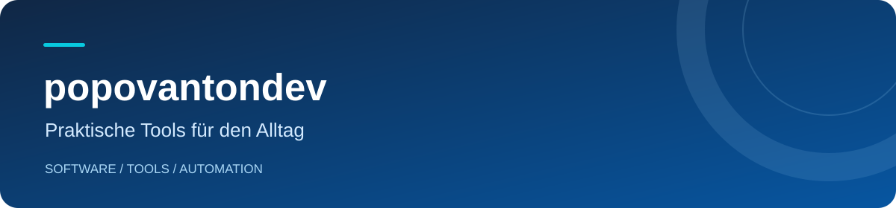

**[Deutsch](README.de.md) · [Русский](README.ru.md) · [English](README.md)**

Ich entwickle Anwendungen und Werkzeuge für verschiedene Plattformen. Dabei lege ich Wert auf verständliche Oberflächen und eine einfache Einrichtung.

### Mein Projekt

### [Telegram Media Sender](https://github.com/popovantondev/TelegramMediaSender)

Eine macOS-App, die nummerierte Pakete aus Videos, Audiodateien und Untertiteln der Reihe nach an Telegram sendet.

- **Flexible Pakete** — Video, Audio, Untertitel oder eine Kombination.
- **Vor dem Senden prüfen** — ausgewählte Dateien und mögliche Duplikate kontrollieren.
- **Drei Oberflächensprachen** — Deutsch, Russisch und Englisch.
- **Lokale Profile** — Telegram-Zugangsdaten und Sitzungen werden auf Ihrem Mac gespeichert.

**[Für macOS herunterladen](https://github.com/popovantondev/TelegramMediaSender/releases/latest)** · **[Quellcode & Dokumentation](https://github.com/popovantondev/TelegramMediaSender)** · **[Feedback](https://github.com/popovantondev/TelegramMediaSender/issues/new/choose)**

Anwendung ansehen

 

*Beispieldateien; kein Telegram-Konto ist verbunden.*

### Weitere Projekte

- [Anki SOUND](https://github.com/popovantondev/AnkiSound) — macOS · aktuelles Release [3.4.11](https://github.com/popovantondev/AnkiSound/releases/latest); lokale Sprachgenerierung für Anki-Karten.
- [LectureTranslate](https://github.com/popovantondev/LectureTranslate) — macOS 15+ · Release [3.5.1](https://github.com/popovantondev/LectureTranslate/releases/latest); Untertitel von Vorlesungen mit prüfbaren Entwürfen übersetzen.
- [SRT to Sound](https://github.com/popovantondev/SRTtoSound) — macOS 15+ · Release [3.5.0](https://github.com/popovantondev/SRTtoSound/releases/latest); synchronisierte russische Sprachausgabe aus SRT-Dateien erstellen. Python, FFmpeg und Modellgewichte sind separat.
- [LectureMerge](https://github.com/popovantondev/LectureMerge) — macOS 14+ · Release [2.2.0](https://github.com/popovantondev/LectureMerge/releases/latest); Vorlesungsvideo, Audio und Untertitel verbinden.
- [Kaktus Backup & Sync](https://github.com/popovantondev/Kaktus-Backup-Sync) — Windows x64 · [5.2.0-preview.7](https://github.com/popovantondev/Kaktus-Backup-Sync/releases/tag/v5.2.0-preview.7); portable Sicherung in eine Richtung, weiterhin Preview.
- [Hotspot Control](https://github.com/popovantondev/HotspotControl) — Windows 11 24H2+ x64 · [0.3.0](https://github.com/popovantondev/HotspotControl/releases/latest); Mobile-Hotspot-Einstellungen verwalten.
- [MegaProg](https://github.com/popovantondev/MegaProg) — macOS · Preview 4.5.1; freigegebene Entwicklungspläne und Prüfungen organisieren.
- [Lecture Companion](https://github.com/popovantondev/LectureCompanion) — Windows 11 x64 · Version 2.4 ist ein unveröffentlichter Entwurf ohne öffentliche Programmdateien.
- [Study Archive Prep](https://github.com/popovantondev/StudyArchivePrep) — macOS · frühe Entwicklung, nur Quelltext und Dokumentation.
- [OpenMedia Downloader](https://github.com/popovantondev/openmedia-downloader) — macOS · nur Quelltext; die Freigabe der Drittanbieterkomponenten wird noch geprüft.

### Technologie von Telegram Media Sender

### Technologien des Projekts

**Python** · **PySide6 / Qt** · **Telethon** · **PyInstaller**

### Anleitungen zur Anwendung

[Benutzerhandbuch](https://github.com/popovantondev/TelegramMediaSender/blob/main/docs/de/README.md) · [Telegram einrichten](https://github.com/popovantondev/TelegramMediaSender/blob/main/docs/de/telegram-setup.md)

Fehlerberichte und Vorschläge können auf Deutsch, Russisch oder Englisch in den Issues des Projekts eingereicht werden.
