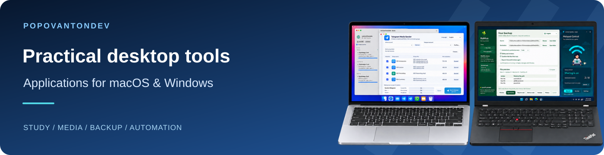

<a href="README.ru.md">Русский</a> · <a href="README.de.md">Deutsch</a> · <a href="README.md">English</a>

I build desktop tools for studying, working with media and managing everyday tasks on macOS and Windows.

**[→ Browse applications & guides](https://popovantondev.github.io/popovantondev/index.html)**

## Featured applications

<table>
<tr>
<td width="50%" valign="top"><h3><a href="https://github.com/popovantondev/TelegramMediaSender">Telegram Media Sender</a></h3>
Send numbered bundles of video, audio and subtitles to Telegram in your chosen order.

macOS 13+ · Apple Silicon Release 1.1.2

<a href="https://github.com/popovantondev/TelegramMediaSender/releases/tag/v1.1.2">Download</a> · <a href="https://popovantondev.github.io/TelegramMediaSender/Guide-en.html">User guide</a> · <a href="https://github.com/popovantondev/TelegramMediaSender/issues/new/choose">Report a problem</a>
</td>
<td width="50%" valign="top"><h3><a href="https://github.com/popovantondev/AnkiSound">Anki SOUND</a></h3>
Add local speech to selected Anki cards and save a separately verified package.

macOS 13+ · Apple Silicon Release 3.4.11

<a href="https://github.com/popovantondev/AnkiSound/releases/tag/v3.4.11">Download</a> · <a href="https://popovantondev.github.io/AnkiSound/Guide-en.html">User guide</a> · <a href="https://github.com/popovantondev/AnkiSound/issues/new/choose">Report a problem</a>
</td>
</tr>
<tr>
<td width="50%" valign="top"><h3><a href="https://github.com/popovantondev/LectureTranslate">LectureTranslate</a></h3>
Translate German SRT subtitles into Russian with preserved timecodes, a queue and draft review.

macOS 15+ · Apple Silicon Release 3.5.1

<a href="https://github.com/popovantondev/LectureTranslate/releases/tag/v3.5.1">Download</a> · <a href="https://popovantondev.github.io/LectureTranslate/Guide-en.html">User guide</a> · <a href="https://github.com/popovantondev/LectureTranslate/issues/new/choose">Report a problem</a>
</td>
<td width="50%" valign="top"><h3><a href="https://github.com/popovantondev/LectureMerge">LectureMerge</a></h3>
Combine lecture video, narration, original audio and subtitles into MP4, or export audio.

macOS 14+ · Apple Silicon Release 2.2.0

<a href="https://github.com/popovantondev/LectureMerge/releases/tag/v2.2.0">Download</a> · <a href="https://popovantondev.github.io/LectureMerge/Guide-en.html">User guide</a> · <a href="https://github.com/popovantondev/LectureMerge/issues/new/choose">Report a problem</a>
</td>
</tr>
<tr>
<td width="50%" valign="top"><h3><a href="https://github.com/popovantondev/HotspotControl">Hotspot Control</a></h3>
Control Windows Mobile Hotspot and view devices and network settings.

Windows 11 24H2+ · x64 Release 0.3.0

<a href="https://github.com/popovantondev/HotspotControl/releases/tag/v0.3.0">Download</a> · <a href="https://popovantondev.github.io/HotspotControl/Guide-en.html">User guide</a> · <a href="https://github.com/popovantondev/HotspotControl/issues/new/choose">Report a problem</a>
</td>
<td width="50%" valign="top"><h3><a href="https://github.com/popovantondev/Kaktus-Backup-Sync">Kaktus Backup &amp; Sync</a></h3>
One-way folder backup with a preview and preserved previous file versions.

Windows · x64 Preview 5.2.0-preview.7

<a href="https://github.com/popovantondev/Kaktus-Backup-Sync/releases/tag/v5.2.0-preview.7">Download</a> · <a href="https://popovantondev.github.io/Kaktus-Backup-Sync/Guide-en.html">User guide</a> · <a href="https://github.com/popovantondev/Kaktus-Backup-Sync/issues/new/choose">Report a problem</a>
</td>
</tr>
</table>

## All applications

| Applications | Platform / Status | Links |
|---|---|---|
| [Telegram Media Sender](https://github.com/popovantondev/TelegramMediaSender) | macOS 13+ · Apple Silicon Release 1.1.2 | [Download](https://github.com/popovantondev/TelegramMediaSender/releases/tag/v1.1.2) · [User guide](https://popovantondev.github.io/TelegramMediaSender/Guide-en.html) · [Report a problem](https://github.com/popovantondev/TelegramMediaSender/issues/new/choose) |
| [Anki SOUND](https://github.com/popovantondev/AnkiSound) | macOS 13+ · Apple Silicon Release 3.4.11 | [Download](https://github.com/popovantondev/AnkiSound/releases/tag/v3.4.11) · [User guide](https://popovantondev.github.io/AnkiSound/Guide-en.html) · [Report a problem](https://github.com/popovantondev/AnkiSound/issues/new/choose) |
| [LectureTranslate](https://github.com/popovantondev/LectureTranslate) | macOS 15+ · Apple Silicon Release 3.5.1 | [Download](https://github.com/popovantondev/LectureTranslate/releases/tag/v3.5.1) · [User guide](https://popovantondev.github.io/LectureTranslate/Guide-en.html) · [Report a problem](https://github.com/popovantondev/LectureTranslate/issues/new/choose) |
| [SRT to Sound](https://github.com/popovantondev/SRTtoSound) | macOS 15+ · Apple Silicon Release 3.5.0 | [Download](https://github.com/popovantondev/SRTtoSound/releases/tag/v3.5.0) · [User guide](https://popovantondev.github.io/SRTtoSound/Guide-en.html) · [Report a problem](https://github.com/popovantondev/SRTtoSound/issues/new/choose) |
| [LectureMerge](https://github.com/popovantondev/LectureMerge) | macOS 14+ · Apple Silicon Release 2.2.0 | [Download](https://github.com/popovantondev/LectureMerge/releases/tag/v2.2.0) · [User guide](https://popovantondev.github.io/LectureMerge/Guide-en.html) · [Report a problem](https://github.com/popovantondev/LectureMerge/issues/new/choose) |
| [Kaktus Backup & Sync](https://github.com/popovantondev/Kaktus-Backup-Sync) | Windows · x64 Preview 5.2.0-preview.7 | [Download](https://github.com/popovantondev/Kaktus-Backup-Sync/releases/tag/v5.2.0-preview.7) · [User guide](https://popovantondev.github.io/Kaktus-Backup-Sync/Guide-en.html) · [Report a problem](https://github.com/popovantondev/Kaktus-Backup-Sync/issues/new/choose) |
| [Hotspot Control](https://github.com/popovantondev/HotspotControl) | Windows 11 24H2+ · x64 Release 0.3.0 | [Download](https://github.com/popovantondev/HotspotControl/releases/tag/v0.3.0) · [User guide](https://popovantondev.github.io/HotspotControl/Guide-en.html) · [Report a problem](https://github.com/popovantondev/HotspotControl/issues/new/choose) |
| [MegaProg](https://github.com/popovantondev/MegaProg) | macOS · Apple Silicon Preview 4.5.1 | [Download](https://github.com/popovantondev/MegaProg/releases/tag/v4.5.1-preview.1) · [User guide](https://popovantondev.github.io/MegaProg/Guide-en.html) · [Report a problem](https://github.com/popovantondev/MegaProg/issues/new/choose) |
| [Lecture Companion](https://github.com/popovantondev/LectureCompanion) | Windows 11 · x64 Preview 2.4 | [Download](https://github.com/popovantondev/LectureCompanion/releases/tag/v2.4) · [User guide](https://popovantondev.github.io/LectureCompanion/Guide-en.html) · [Report a problem](https://github.com/popovantondev/LectureCompanion/issues/new/choose) |
| [Study Archive Prep](https://github.com/popovantondev/StudyArchivePrep) | macOS 13+ · Apple Silicon Source only 0.1.0 | [Source](https://github.com/popovantondev/StudyArchivePrep) · [User guide](https://popovantondev.github.io/StudyArchivePrep/Guide-en.html) · [Report a problem](https://github.com/popovantondev/StudyArchivePrep/issues/new/choose) |
| [OpenMedia Downloader](https://github.com/popovantondev/openmedia-downloader) | macOS 15+ · Apple Silicon Source only 5.5.0 | [Source](https://github.com/popovantondev/openmedia-downloader) · [User guide](https://popovantondev.github.io/openmedia-downloader/Guide-en.html) · [Report a problem](https://github.com/popovantondev/openmedia-downloader/issues/new/choose) |
| [GitHubSync](https://github.com/popovantondev/GitHubSync) | Windows 10/11 · x64 Release 1.5.3 | [Download](https://github.com/popovantondev/GitHubSync/releases/tag/v1.5.3) · [User guide](https://popovantondev.github.io/GitHubSync/Guide-en.html) · [Report a problem](https://github.com/popovantondev/GitHubSync/issues/new/choose) |

## Interface previews

Telegram Media Sender

*Demonstration interface; no real Telegram account connected.*

Lecture Companion

*Published v2.4 demonstration with synthetic data.*

## Downloads & support

Open a program’s guide for requirements and first steps. Download the application from Releases, not the source-code ZIP. Preview releases are still being developed; source-only projects have no ready-to-install package.

For help or a bug report, use “Report a problem” in the application catalog. Include the application version, operating system and steps to reproduce the problem.

### Built with

Swift · Python · C# / .NET · SwiftUI · PySide6 / Qt · WPF

Read the guide and release notes before use.
