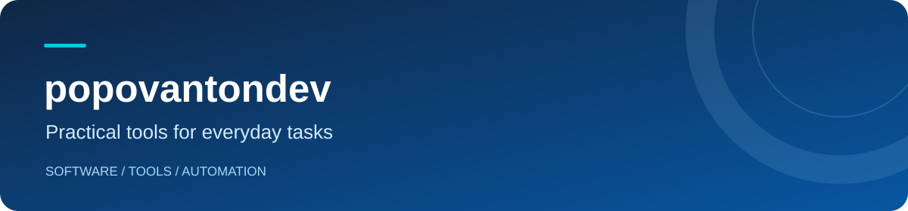

**[Deutsch](README.de.md) · [Русский](README.ru.md) · [English](README.md)**

I develop applications and tools for different platforms, with a focus on clear interfaces and straightforward setup.

### Featured project

### [Telegram Media Sender](https://github.com/popovantondev/TelegramMediaSender)

A macOS app for sending numbered batches of videos, audio and subtitles to Telegram, in order.

- **Flexible bundles** — video, audio, subtitles, or a combination.
- **Before you send** — review selected files and possible duplicates.
- **Three interface languages** — Deutsch, Русский and English.
- **Local profiles** — Telegram credentials and sessions are stored on your Mac.

**[Download for macOS](https://github.com/popovantondev/TelegramMediaSender/releases/latest)** · **[Source & documentation](https://github.com/popovantondev/TelegramMediaSender)** · **[Feedback](https://github.com/popovantondev/TelegramMediaSender/issues/new/choose)**

See the application

 

*Demonstration files; no connected Telegram account.*

### More projects

- [Anki SOUND](https://github.com/popovantondev/AnkiSound) — macOS · current release [3.4.11](https://github.com/popovantondev/AnkiSound/releases/latest); local speech generation for Anki cards.
- [LectureTranslate](https://github.com/popovantondev/LectureTranslate) — macOS 15+ · release [3.5.1](https://github.com/popovantondev/LectureTranslate/releases/latest); translate lecture subtitles with reviewable drafts.
- [SRT to Sound](https://github.com/popovantondev/SRTtoSound) — macOS 15+ · release [3.5.0](https://github.com/popovantondev/SRTtoSound/releases/latest); create synchronized Russian speech from SRT files. Python, FFmpeg and model weights are separate.
- [LectureMerge](https://github.com/popovantondev/LectureMerge) — macOS 14+ · release [2.2.0](https://github.com/popovantondev/LectureMerge/releases/latest); combine lecture video, audio and subtitles.
- [Kaktus Backup & Sync](https://github.com/popovantondev/Kaktus-Backup-Sync) — Windows x64 · [5.2.0-preview.7](https://github.com/popovantondev/Kaktus-Backup-Sync/releases/tag/v5.2.0-preview.7); portable one-way folder backup, still a preview.
- [Hotspot Control](https://github.com/popovantondev/HotspotControl) — Windows 11 24H2+ x64 · [0.3.0](https://github.com/popovantondev/HotspotControl/releases/latest); manage Mobile Hotspot settings.
- [MegaProg](https://github.com/popovantondev/MegaProg) — macOS · Preview 4.5.1; organize approved development plans and verification.
- [Lecture Companion](https://github.com/popovantondev/LectureCompanion) — Windows 11 x64 · [public v2.4 pre-release](https://github.com/popovantondev/LectureCompanion/releases/tag/v2.4); the portable archive is split into four parts and verified by JoinPortable.cmd.
- [Study Archive Prep](https://github.com/popovantondev/StudyArchivePrep) — macOS · early development, source and documentation only.
- [OpenMedia Downloader](https://github.com/popovantondev/openmedia-downloader) — macOS · source only; third-party release clearance is still under review.

### Telegram Media Sender technology

### Project stack

**Python** · **PySide6 / Qt** · **Telethon** · **PyInstaller**

### Project guides

[User guide](https://github.com/popovantondev/TelegramMediaSender/blob/main/docs/en/README.md) · [Connect Telegram](https://github.com/popovantondev/TelegramMediaSender/blob/main/docs/en/telegram-setup.md)

Bug reports and suggestions are welcome in English, German or Russian through the project's Issues.
