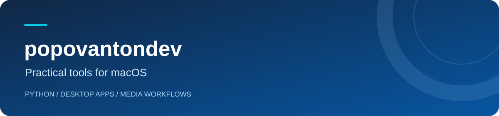

I build macOS tools for everyday media tasks, with a focus on clear interfaces and straightforward setup.

### Featured project

## [Telegram Media Sender](https://github.com/popovantondev/TelegramMediaSender)

Send numbered batches of videos, audio and subtitles to Telegram, in order.

- **Flexible bundles** — video, audio, subtitles, or a combination.
- **Before you send** — review selected files and possible duplicates.
- **Three interface languages** — Deutsch, Русский and English.
- **Local profiles** — Telegram credentials and sessions are stored on your Mac.

**[Download for macOS](https://github.com/popovantondev/TelegramMediaSender/releases/latest)** &nbsp; · &nbsp; **[Source & documentation](https://github.com/popovantondev/TelegramMediaSender)** &nbsp; · &nbsp; **[Feedback](https://github.com/popovantondev/TelegramMediaSender/issues/new/choose)**

See the application

 

*Demonstration files; no connected Telegram account.*

### Project stack

**Python** · **PySide6 / Qt** · **Telethon** · **PyInstaller**

### Read in your language

| Deutsch | Русский | English |
| --- | --- | --- |
| [Anleitung](https://github.com/popovantondev/TelegramMediaSender/blob/main/docs/de/README.md) | [Руководство](https://github.com/popovantondev/TelegramMediaSender/blob/main/docs/ru/README.md) | [User guide](https://github.com/popovantondev/TelegramMediaSender/blob/main/docs/en/README.md) |
| [Telegram einrichten](https://github.com/popovantondev/TelegramMediaSender/blob/main/docs/de/telegram-setup.md) | [Подключение Telegram](https://github.com/popovantondev/TelegramMediaSender/blob/main/docs/ru/telegram-setup.md) | [Connect Telegram](https://github.com/popovantondev/TelegramMediaSender/blob/main/docs/en/telegram-setup.md) |

Bug reports and suggestions are welcome in English, German or Russian through the project's Issues.
