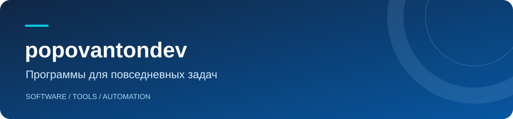

**[Deutsch](README.de.md) · [Русский](README.ru.md) · [English](README.md)**

Разрабатываю приложения и инструменты для разных платформ. Уделяю внимание понятному интерфейсу и простой настройке.

### Мой проект

### [Telegram Media Sender](https://github.com/popovantondev/TelegramMediaSender)

Приложение для macOS, которое отправляет пронумерованные комплекты видео, аудио и субтитров в Telegram по порядку.

- **Разные комплекты** — видео, аудио, субтитры или их сочетание.
- **Проверка перед отправкой** — просмотр выбранных файлов и возможных повторов.
- **Три языка интерфейса** — немецкий, русский и английский.
- **Локальные профили** — данные подключения и сессии Telegram хранятся на вашем Mac.

**[Скачать для macOS](https://github.com/popovantondev/TelegramMediaSender/releases/latest)** · **[Код и документация](https://github.com/popovantondev/TelegramMediaSender)** · **[Обратная связь](https://github.com/popovantondev/TelegramMediaSender/issues/new/choose)**

Посмотреть приложение

 

*Демонстрационные файлы; аккаунт Telegram не подключён.*

### Другие проекты

- [Anki SOUND](https://github.com/popovantondev/AnkiSound) — macOS · текущий выпуск [3.4.11](https://github.com/popovantondev/AnkiSound/releases/latest); локальная генерация речи для карточек Anki.
- [LectureTranslate](https://github.com/popovantondev/LectureTranslate) — macOS 15+ · выпуск [3.5.1](https://github.com/popovantondev/LectureTranslate/releases/latest); перевод субтитров лекций с черновиками для проверки.
- [SRT to Sound](https://github.com/popovantondev/SRTtoSound) — macOS 15+ · выпуск [3.5.0](https://github.com/popovantondev/SRTtoSound/releases/latest); синхронизированная озвучка русских SRT. Python, FFmpeg и веса модели устанавливаются отдельно.
- [LectureMerge](https://github.com/popovantondev/LectureMerge) — macOS 14+ · выпуск [2.2.0](https://github.com/popovantondev/LectureMerge/releases/latest); объединение видео лекции, аудио и субтитров.
- [Kaktus Backup & Sync](https://github.com/popovantondev/Kaktus-Backup-Sync) — Windows x64 · [5.2.0-preview.7](https://github.com/popovantondev/Kaktus-Backup-Sync/releases/tag/v5.2.0-preview.7); переносное резервное копирование папок в одном направлении, пока Preview.
- [Hotspot Control](https://github.com/popovantondev/HotspotControl) — Windows 11 24H2+ x64 · [0.3.0](https://github.com/popovantondev/HotspotControl/releases/latest); управление параметрами мобильной точки доступа.
- [MegaProg](https://github.com/popovantondev/MegaProg) — macOS · Preview 4.5.1; организация утверждённых планов разработки и проверок.
- [Lecture Companion](https://github.com/popovantondev/LectureCompanion) — Windows 11 x64 · [предварительный выпуск v2.4](https://github.com/popovantondev/LectureCompanion/releases/tag/v2.4) опубликован; Portable-архив разделён на четыре части, а JoinPortable.cmd проверяет и собирает их.
- [Study Archive Prep](https://github.com/popovantondev/StudyArchivePrep) — macOS · ранняя разработка, доступны только исходники и документация.
- [OpenMedia Downloader](https://github.com/popovantondev/openmedia-downloader) — macOS · только исходники; проверка прав на распространение сторонних компонентов ещё не завершена.

### Технологии Telegram Media Sender

### Стек проекта

**Python** · **PySide6 / Qt** · **Telethon** · **PyInstaller**

### Lecture Companion для Microsoft Teams

Анимированный робот-помощник для лекций в Teams на Windows 11. Он кратко пересказывает новые живые субтитры и по запросу объясняет демонстрируемый слайд. Обработка выполняется на компьютере.

- **Три языка** — немецкий, английский и русский.
- **Переносимая версия** — без отдельной установки Python и API-ключа.
- **Конфиденциальность** — без записи микрофона и облачного резерва.

**[Предварительный релиз v2.4](https://github.com/popovantondev/LectureCompanion/releases/tag/v2.4)** · **[Обзор и быстрый старт](https://github.com/popovantondev/LectureCompanion/blob/main/README.ru.md)** · **[Сообщить о проблеме](https://github.com/popovantondev/LectureCompanion/issues/new/choose)**

Посмотреть приложение

 

*Скриншот опубликованной версии v2.4; синтетические данные, без реальной встречи.*

### Инструкции к приложению

[Руководство пользователя](https://github.com/popovantondev/TelegramMediaSender/blob/main/docs/ru/README.md) · [Подключение Telegram](https://github.com/popovantondev/TelegramMediaSender/blob/main/docs/ru/telegram-setup.md)

Об ошибках и предложениях можно написать на русском, немецком или английском в разделе Issues проекта.
