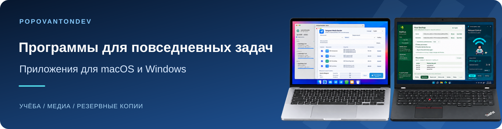

<a href="README.ru.md">Русский</a> · <a href="README.de.md">Deutsch</a> · <a href="README.md">English</a>

Разрабатываю приложения для учёбы, работы с медиа и повседневных задач на macOS и Windows.

**[→ Каталог программ и руководств](https://popovantondev.github.io/popovantondev/index-ru.html)**

## Основные программы

<table>
<tr>
<td width="50%" valign="top"><h3><a href="https://github.com/popovantondev/TelegramMediaSender">Telegram Media Sender</a></h3>
Отправляет пронумерованные наборы видео, аудио и субтитров в Telegram в выбранном порядке.

macOS 13+ · Apple Silicon Выпуск 1.1.2

<a href="https://github.com/popovantondev/TelegramMediaSender/releases/tag/v1.1.2">Скачать</a> · <a href="https://popovantondev.github.io/TelegramMediaSender/Guide-ru.html">Инструкция</a> · <a href="https://github.com/popovantondev/TelegramMediaSender/issues/new/choose">Сообщить об ошибке</a>
</td>
<td width="50%" valign="top"><h3><a href="https://github.com/popovantondev/AnkiSound">Anki SOUND</a></h3>
Добавляет локальную озвучку выбранным карточкам Anki и сохраняет отдельный проверенный пакет.

macOS 13+ · Apple Silicon Выпуск 3.4.11

<a href="https://github.com/popovantondev/AnkiSound/releases/tag/v3.4.11">Скачать</a> · <a href="https://popovantondev.github.io/AnkiSound/Guide-ru.html">Инструкция</a> · <a href="https://github.com/popovantondev/AnkiSound/issues/new/choose">Сообщить об ошибке</a>
</td>
</tr>
<tr>
<td width="50%" valign="top"><h3><a href="https://github.com/popovantondev/LectureTranslate">LectureTranslate</a></h3>
Переводит немецкие SRT-субтитры на русский с сохранением таймкодов, очередью и проверкой черновика.

macOS 15+ · Apple Silicon Выпуск 3.5.1

<a href="https://github.com/popovantondev/LectureTranslate/releases/tag/v3.5.1">Скачать</a> · <a href="https://popovantondev.github.io/LectureTranslate/Guide-ru.html">Инструкция</a> · <a href="https://github.com/popovantondev/LectureTranslate/issues/new/choose">Сообщить об ошибке</a>
</td>
<td width="50%" valign="top"><h3><a href="https://github.com/popovantondev/LectureMerge">LectureMerge</a></h3>
Объединяет видео лекции, озвучку, исходное аудио и субтитры в MP4; также экспортирует аудио.

macOS 14+ · Apple Silicon Выпуск 2.2.0

<a href="https://github.com/popovantondev/LectureMerge/releases/tag/v2.2.0">Скачать</a> · <a href="https://popovantondev.github.io/LectureMerge/Guide-ru.html">Инструкция</a> · <a href="https://github.com/popovantondev/LectureMerge/issues/new/choose">Сообщить об ошибке</a>
</td>
</tr>
<tr>
<td width="50%" valign="top"><h3><a href="https://github.com/popovantondev/HotspotControl">Hotspot Control</a></h3>
Управляет мобильной точкой доступа Windows, показывает устройства и настройки сети.

Windows 11 24H2+ · x64 Выпуск 0.3.0

<a href="https://github.com/popovantondev/HotspotControl/releases/tag/v0.3.0">Скачать</a> · <a href="https://popovantondev.github.io/HotspotControl/Guide-ru.html">Инструкция</a> · <a href="https://github.com/popovantondev/HotspotControl/issues/new/choose">Сообщить об ошибке</a>
</td>
<td width="50%" valign="top"><h3><a href="https://github.com/popovantondev/Kaktus-Backup-Sync">Kaktus Backup &amp; Sync</a></h3>
Выполняет одностороннее резервное копирование папок с предварительным просмотром и сохранением предыдущих версий.

Windows · x64 Предварительный выпуск 5.2.0-preview.7

<a href="https://github.com/popovantondev/Kaktus-Backup-Sync/releases/tag/v5.2.0-preview.7">Скачать</a> · <a href="https://popovantondev.github.io/Kaktus-Backup-Sync/Guide-ru.html">Инструкция</a> · <a href="https://github.com/popovantondev/Kaktus-Backup-Sync/issues/new/choose">Сообщить об ошибке</a>
</td>
</tr>
</table>

## Все программы

| Программы | Платформа / Статус | Ссылки |
|---|---|---|
| [Telegram Media Sender](https://github.com/popovantondev/TelegramMediaSender) | macOS 13+ · Apple Silicon Выпуск 1.1.2 | [Скачать](https://github.com/popovantondev/TelegramMediaSender/releases/tag/v1.1.2) · [Инструкция](https://popovantondev.github.io/TelegramMediaSender/Guide-ru.html) · [Сообщить об ошибке](https://github.com/popovantondev/TelegramMediaSender/issues/new/choose) |
| [Anki SOUND](https://github.com/popovantondev/AnkiSound) | macOS 13+ · Apple Silicon Выпуск 3.4.11 | [Скачать](https://github.com/popovantondev/AnkiSound/releases/tag/v3.4.11) · [Инструкция](https://popovantondev.github.io/AnkiSound/Guide-ru.html) · [Сообщить об ошибке](https://github.com/popovantondev/AnkiSound/issues/new/choose) |
| [LectureTranslate](https://github.com/popovantondev/LectureTranslate) | macOS 15+ · Apple Silicon Выпуск 3.5.1 | [Скачать](https://github.com/popovantondev/LectureTranslate/releases/tag/v3.5.1) · [Инструкция](https://popovantondev.github.io/LectureTranslate/Guide-ru.html) · [Сообщить об ошибке](https://github.com/popovantondev/LectureTranslate/issues/new/choose) |
| [SRT to Sound](https://github.com/popovantondev/SRTtoSound) | macOS 15+ · Apple Silicon Выпуск 3.5.0 | [Скачать](https://github.com/popovantondev/SRTtoSound/releases/tag/v3.5.0) · [Инструкция](https://popovantondev.github.io/SRTtoSound/Guide-ru.html) · [Сообщить об ошибке](https://github.com/popovantondev/SRTtoSound/issues/new/choose) |
| [LectureMerge](https://github.com/popovantondev/LectureMerge) | macOS 14+ · Apple Silicon Выпуск 2.2.0 | [Скачать](https://github.com/popovantondev/LectureMerge/releases/tag/v2.2.0) · [Инструкция](https://popovantondev.github.io/LectureMerge/Guide-ru.html) · [Сообщить об ошибке](https://github.com/popovantondev/LectureMerge/issues/new/choose) |
| [Kaktus Backup & Sync](https://github.com/popovantondev/Kaktus-Backup-Sync) | Windows · x64 Предварительный выпуск 5.2.0-preview.7 | [Скачать](https://github.com/popovantondev/Kaktus-Backup-Sync/releases/tag/v5.2.0-preview.7) · [Инструкция](https://popovantondev.github.io/Kaktus-Backup-Sync/Guide-ru.html) · [Сообщить об ошибке](https://github.com/popovantondev/Kaktus-Backup-Sync/issues/new/choose) |
| [Hotspot Control](https://github.com/popovantondev/HotspotControl) | Windows 11 24H2+ · x64 Выпуск 0.3.0 | [Скачать](https://github.com/popovantondev/HotspotControl/releases/tag/v0.3.0) · [Инструкция](https://popovantondev.github.io/HotspotControl/Guide-ru.html) · [Сообщить об ошибке](https://github.com/popovantondev/HotspotControl/issues/new/choose) |
| [MegaProg](https://github.com/popovantondev/MegaProg) | macOS · Apple Silicon Предварительный выпуск 4.5.1 | [Скачать](https://github.com/popovantondev/MegaProg/releases/tag/v4.5.1-preview.1) · [Инструкция](https://popovantondev.github.io/MegaProg/Guide-ru.html) · [Сообщить об ошибке](https://github.com/popovantondev/MegaProg/issues/new/choose) |
| [Lecture Companion](https://github.com/popovantondev/LectureCompanion) | Windows 11 · x64 Предварительный выпуск 2.4 | [Скачать](https://github.com/popovantondev/LectureCompanion/releases/tag/v2.4) · [Инструкция](https://popovantondev.github.io/LectureCompanion/Guide-ru.html) · [Сообщить об ошибке](https://github.com/popovantondev/LectureCompanion/issues/new/choose) |
| [Study Archive Prep](https://github.com/popovantondev/StudyArchivePrep) | macOS 13+ · Apple Silicon Только исходники 0.1.0 | [Исходники](https://github.com/popovantondev/StudyArchivePrep) · [Инструкция](https://popovantondev.github.io/StudyArchivePrep/Guide-ru.html) · [Сообщить об ошибке](https://github.com/popovantondev/StudyArchivePrep/issues/new/choose) |
| [OpenMedia Downloader](https://github.com/popovantondev/openmedia-downloader) | macOS 15+ · Apple Silicon Только исходники 5.5.0 | [Исходники](https://github.com/popovantondev/openmedia-downloader) · [Инструкция](https://popovantondev.github.io/openmedia-downloader/Guide-ru.html) · [Сообщить об ошибке](https://github.com/popovantondev/openmedia-downloader/issues/new/choose) |
| [GitHubSync](https://github.com/popovantondev/GitHubSync) | Windows 10/11 · x64 Выпуск 1.5.3 | [Скачать](https://github.com/popovantondev/GitHubSync/releases/tag/v1.5.3) · [Инструкция](https://popovantondev.github.io/GitHubSync/Guide-ru.html) · [Сообщить об ошибке](https://github.com/popovantondev/GitHubSync/issues/new/choose) |
| [Virtual Piano Arranger](https://github.com/popovantondev/VirtualPianoArranger) | Windows · x64 Предварительный выпуск 0.1.0-preview.1 | [Скачать](https://github.com/popovantondev/VirtualPianoArranger/releases/tag/v0.1.0-preview.1) · [Инструкция](https://popovantondev.github.io/VirtualPianoArranger/Guide-ru.html) · [Сообщить об ошибке](https://github.com/popovantondev/VirtualPianoArranger/issues/new) |
| [SoundLeaf](https://github.com/popovantondev/SoundLeaf) | Windows 11 · x64 Предварительный выпуск 3.0.5 | [Скачать](https://github.com/popovantondev/SoundLeaf/releases/tag/v3.0.5) · [Инструкция](https://popovantondev.github.io/SoundLeaf/Guide-ru.html) · [Сообщить об ошибке](https://github.com/popovantondev/SoundLeaf/issues/new/choose) |

## Посмотреть интерфейсы

Telegram Media Sender

*Демонстрационный интерфейс; настоящий аккаунт Telegram не подключён.*

Lecture Companion

*Опубликованная демонстрация v2.4 с синтетическими данными.*

## Загрузка и помощь

В руководстве каждой программы указаны требования и первые шаги. Скачивайте приложение из Releases, а не ZIP с исходниками. Preview — предварительные версии; для проектов со статусом «Только исходники» готового установочного пакета нет.

Для вопроса или сообщения об ошибке откройте «Сообщить об ошибке» в каталоге. Укажите версию программы, ОС и действия, после которых возникла проблема.

### Технологии

Swift · Python · C# / .NET · SwiftUI · PySide6 / Qt · WPF

Перед использованием прочитайте руководство и примечания к выпуску.
